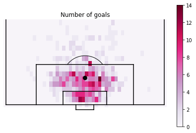
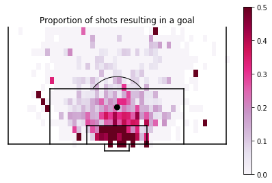
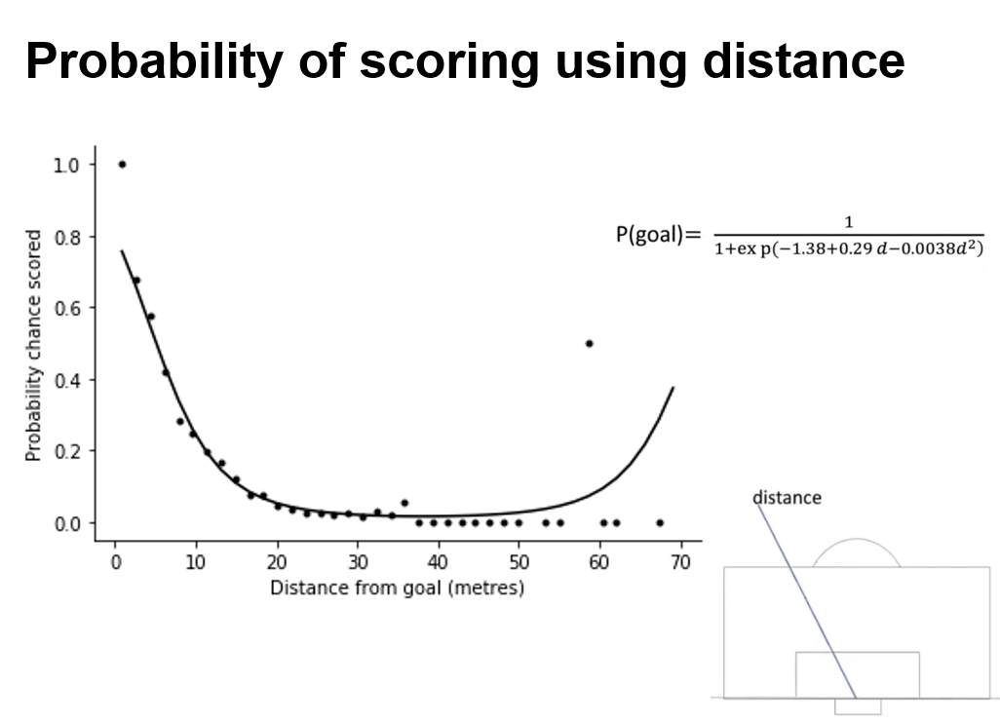
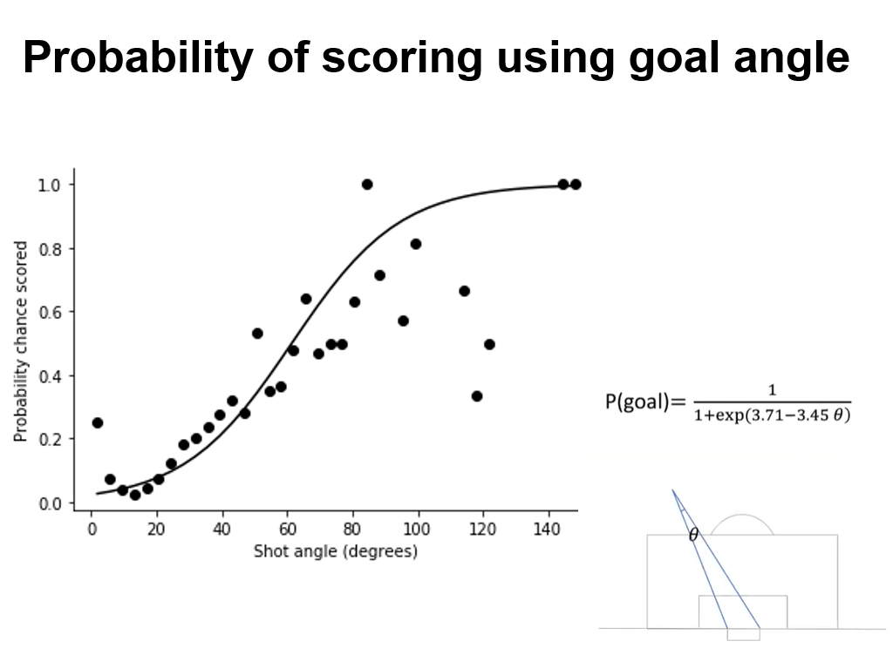
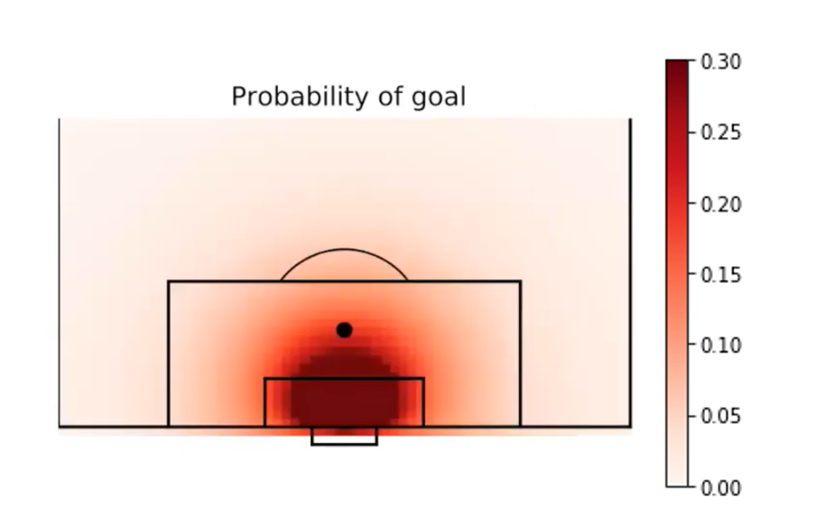

# Modeling-expected-goals-from-football-data-with-Python

An `Expected goals (xG)` model is built using events data from a recently concluded season of the English Premier League (https://figshare.com/collections/Soccer_match_event_dataset/4415000/5). It is a statistical model that fits to data, can be used to predict the outcome of events and lays ground for later, more advanced ML models. The model defined here is inspired by this paper: https://www.tandfonline.com/doi/full/10.1080/02640414.2016.1177657

`What is xG?`
It is a statistical measure of chance quality. For example, it is the probability that on a given day a shot taken from a particular location on the pitch would result in a goal scored. Its numerous uses range from **conveying the full story** of a match that tells more than just the scoreline, **predicting future goals scored** (great for bookmaking and betting companies) and **guide players and coaches in decision making**.

*xG used to supplement information in TV feed*: As shown above, Gabriel Jesus's shot map is broken down to represent shots (circles) and goals (stars) with the level of difficulty of each shot (xG) illustrated with a color map. 

The script `Model_xG.py` is used to load the events data. Once the data is loaded, the same script is used to set up the `shots model` which picks out all the shots that are not headers, free-kicks and penalties and puts them in a separate data frame that is subsequently used in the `xG model`. 

Data from `shots model` is then used to create the following three heat maps.

*No. of shots*: A 2D histogram of shot locations, which shows the heat map (frequency) of shots occuring from different locations in front of goal throughout the entire season (380 matches). The scale bar ranges from 0 to 50. The figure clearly shows that a lot of shots are taken from within the penalty area. There are also a number of shots taken from outside the penalty area. This figure does not give any indication on the quality of those shots (goal or no goal).  

*No. of goals scored*: In order to understand which shots result in goals, a 2D histogram of goals from `shots model` is plotted. The scale is much lower in comparison to the previous figure. This figure clearly shows that shots taken from closer to the goal mouth result in goals than much fewer ones scored from a distance. 

*Probability of scoring*: A key result that can be obtained from the previous observations is the probability of scoring goals from different locations, upon which the `xG model` is built. It is simply obtained by dividing the no. of goals scored in each location by the no. of shots taken from that location. There are some anomalous data points that are based on goals scored due to luck or player error, which are required to be smoothed-out for the `xG model`.

Effort to understand data in this way is made easier with a model that not only gives an underlying explanation but also helps to smooth-out the data. The model described here is based on the notion that the probability of scoring a goal will be greater when a player is closer (distance) and can see more of the goal-mouth (angle). 

The first parameter that is used to formulate the model is `shot distance`. In the figure below, the probability of scoring as a function of distance from the goal line is plotted. As expected, the probability of scoring is 1 when a player is 0 metres from goal and it already decreases to 0.2 at a distance of 10 metres. The data is fit using a logistic curve with an expression highlighted in the figure. 

The next parameter used to formulate the model is `shot angle`. Here, the angle created by two lines drawn from the shot location to each of the goal posts is measured. This angle should be lower the further a player is from goal and greater when closer to goal. In the figure below, the probability of scoring as a function of shot angle is plotted. As expected, the probability of scoring increases with shot angle. The fit is obtained using a logistic curve with an expression highlighted in the figure. 

Finally, the each shot is assigned a new probability of scoring based on the two criteria mentioned above and the `xG model` is thus formulated (below).

