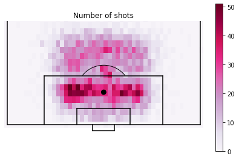

# Modeling-expected-goals-from-football-data-with-Python

An `Expected goals (xG)` model is built using events data from a recently concluded season of the English Premier League (https://figshare.com/collections/Soccer_match_event_dataset/4415000/5). It is a statistical model that fits to data, can be used to predict the outcome of events and lays ground for later, more advanced ML models.

`What is xG?`
It is a statistical measure of chance quality. For example, it is the probability that on a given day a shot taken from a particular location on the pitch would result in a goal scored. Its numerous uses range from **conveying the full story** of a match that tells more than just the scoreline, **predicting future goals scored** (great for bookmaking and betting companies) and **guide players and coaches in decision making**.

*xG used to supplement information in TV feed*: As shown above, Gabriel Jesus's shot map is broken down to represent shots (circles) and goals (stars) with the level of difficulty of each shot (xG) illustrated with a color map. 

The script `Model_xG.py` is used to load the events data. Once the data is loaded, the same script is used to set up the `shots model` which picks out all the shots that are not headers, free-kicks and penalties and puts them in a separate data frame that is subsequently used in the `xG model`. 

The `shots model` data frame is then used to create a 2D histogram of shot locations, an example of which is shown below.

